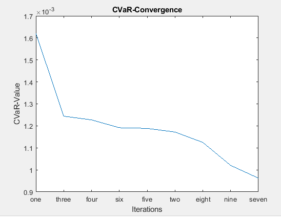

[](http://quantlet.de/)

```yaml
Name of QuantLet: CVaR_converging

Published in: 'DEDA Class'

Description: 'Plotting the CVaR for all sets of different initial weights and see it converging'

Keywords: plot, CVaR, convergence, all sets of initial weights

Author: Georg Velev, Iliyana Pekova

Submitted: Thu, August 01 2019 by Georg Velev, Iliyana Pekova

Output: 'CVaR_convergence in .PNG format'
```




### MATLAB code
```matlab
%sort CVaR descending and plot a  simple graph, where
%minimum easily seen and one can see a convergence
mat1 = array2table(mat)
chr = [{'one', 'two', 'three', 'four', 'five','six','seven','eight','nine'}]
%str = ["one", "two", "three", "four", "five","six","seven","eight","nine"]
trans = array2table(transpose(chr))
mat1 (:,10) = trans
sorted = sortrows(mat1,-5)
y = table2array(sorted(:,5))
x = table2array(sorted(:,10))
plot(y)
set(gca,'xticklabel',x.')
title('CVaR-Convergence')
xlabel('Iterations')
ylabel('CVaR-Value')
```
