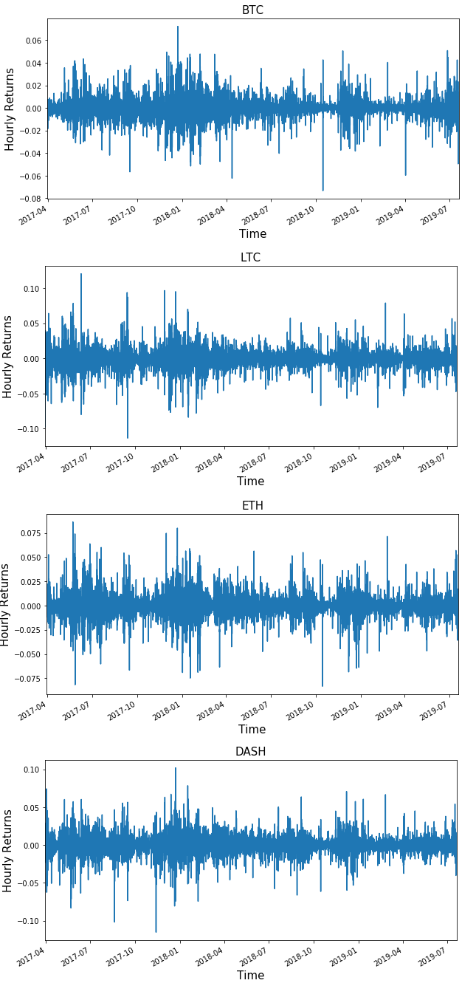

[](http://quantlet.de/)

```yaml
Name of QuantLet: Data_Analysis

Published in: 'DEDA Class'

Description: 'Analyse the hourly returns of the collected data of the four coins.'

Keywords: data, analysis

Author: Georg Velev, Iliyana Pekova

Submitted: Thu, August 01 2019 by Georg Velev, Iliyana Pekova

Output: 'Data_Analysis in .PNG format'

```




### Python Code
```python
import matplotlib.pyplot as plt

plt.figure (figsize=(10,5));ax=litecoin['Hourly_returns'].plot(); ax.set_title('LTC', fontsize=15); ax.set_ylabel("Hourly Returns", fontsize=15);ax.set_xlabel("Time", fontsize=15)
plt.figure (figsize=(10,5));ax=bitcoin['Hourly_returns'].plot(); ax.set_title('BTC', fontsize=15); ax.set_ylabel("Hourly Returns", fontsize=15);ax.set_xlabel("Time", fontsize=15)
plt.figure (figsize=(10,5));ax=dash['Hourly_returns'].plot(); ax.set_title('DASH', fontsize=15); ax.set_ylabel("Hourly Returns", fontsize=15);ax.set_xlabel("Time", fontsize=15)
plt.figure (figsize=(10,5));ax=ethereum['Hourly_returns'].plot(); ax.set_title('ETH', fontsize=15); ax.set_ylabel("Hourly Returns", fontsize=15);ax.set_xlabel("Time", fontsize=15)
```

