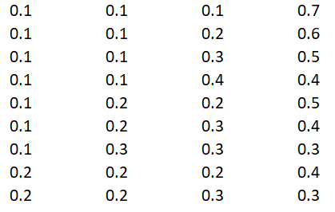

[](http://quantlet.de/)

```yaml
Name of QuantLet: Finding_all_Combinations_of_initial_Weights

Published in: 'DEDA Class'

Description: 'Finding all possible combinations of initial weights for a four-cryptocurrencies-portfolio'

Keywords: initial weights, combinations

Author: Georg Velev, Iliyana Pekova

Submitted: Thu, August 01 2019 by Georg Velev, Iliyana Pekova

Output: 'combis in .png format'
```




### Python Code
```python
# Python3 program to find out all 
# combinations of positive 
# numbers that add upto given number 

# arr - array to store the combination 
# index - next location in array 
# num - given number 
# reducedNum - reduced number 
def findCombinationsUtil(arr, index, num, reducedNum): 

	# Base condition 
	if (reducedNum < 0): 
		return; 

	# If combination is 
	# found, print it 
	if (reducedNum == 0): 

		for i in range(index): 
            print(arr[i], end = " "); 
            print("");
    return; 

	# Find the previous number stored in arr[]. 
	# It helps in maintaining increasing order 
	prev = 1 if(index == 0) else arr[index - 1]; 

	# note loop starts from previous 
	# number i.e. at array location 
	# index - 1 
	for k in range(prev, num + 1): 
		
		# next element of array is k 
		arr[index] = k; 

		# call recursively with 
		# reduced number 
		findCombinationsUtil(arr, index + 1, num, reducedNum - k); 

# Function to find out all 
# combinations of positive numbers 
# that add upto given number. 
# It uses findCombinationsUtil() 
def findCombinations(n): 
	
	# array to store the combinations 
	# It can contain max n elements 
	arr = [0] * n; 

	# find all combinations 
	findCombinationsUtil(arr, 0, n, n); 

# Driver code 
n = 10; 
findCombinations(n)
```
