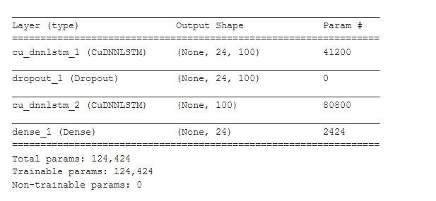

[](http://quantlet.de/)

```yaml
Name of QuantLet: LSTM_Architecture

Published in: 'DEDA Class'

Description: 'Definition of the architecture of the LSTM that is used for the time-series prediction of the hourly returns.'

Keywords: LSTM, architecture, time-series, prediction

Author: Georg Velev, Iliyana Pekova

Submitted: Thu, August 01 2019 by Georg Velev, Iliyana Pekova

Output: 'Architecture_LSTM in .PNG format'
```





### Python Code
```python
import keras.backend as K
def root_mean_squared_error(y_true, y_pred):
        return K.sqrt(K.mean(K.square(y_pred - y_true)))
        
        
def multi_step_LSTM(n_steps_in=24, n_features=1,n_steps_out=24,nr_neurons=100,lr=0.01,epochs=1):
    import tensorflow as tf
    import keras
    from keras import optimizers
    from keras.models import Sequential, Model
    from keras.layers import Dense,LSTM, Dropout, CuDNNLSTM
    from keras.layers.advanced_activations import LeakyReLU, PReLU
    
    model = Sequential()
    model.add(CuDNNLSTM(nr_neurons, return_sequences=True, input_shape=(n_steps_in, n_features),kernel_initializer=keras.initializers.he_normal(seed=42)))
    model.add(Dropout(0.1))
    
    model.add(CuDNNLSTM(nr_neurons ,bias_initializer='ones',kernel_initializer=keras.initializers.he_normal(seed=42)))
    
    model.add(Dense(n_steps_out,bias_initializer='ones',kernel_initializer=keras.initializers.he_normal(seed=42)))
   
    model.compile(optimizer=keras.optimizers.SGD(lr=lr,decay=lr/epochs), loss=root_mean_squared_error)
    return model

  
print(multi_step_LSTM().summary())       
```
