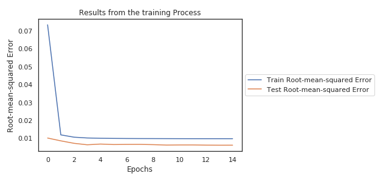

[](http://quantlet.de/)

```yaml
Name of QuantLet: LSTM_Performance_No_Parameter_Tuning

Published in: 'DEDA Class'

Description: 'Training the LSTM on the data of one of the Coins (ETH) and analysing the results on the test set without
              parameter tuning.'

Keywords: LSTM, ETH, results

Author: Georg Velev, Iliyana Pekova

Submitted: Thu, August 01 2019 by Georg Velev, Iliyana Pekova

Output: 'Performance_LSTM_NO_PO in .PNG format'
```




### Python Code
```python
import matplotlib.pyplot as plt

def visualize_results(the_model):
    plt.plot(the_model.history['loss'])
    plt.plot(the_model.history['val_loss'])
    plt.ylabel('Root-mean-squared Error')
    plt.xlabel('Epochs')
    plt.title("Results from the training Process")
    plt.legend(['Train Root-mean-squared Error', 'Test Root-mean-squared Error'], loc='center left', bbox_to_anchor=(1, 0.5))
    plt.show()

X_train_ETH, y_train_ETH, X_test_ETH, y_test_ETH=generate_Xtrain_yTrain_Xtest_Ytest(ETH,0.8,24,24)
early_stop=EarlyStopping(monitor='val_loss', mode='min', verbose=0, patience=10, restore_best_weights=True)
LSTM_model=multi_step_LSTM(n_steps_in=24,epochs=15)
trained_eth=LSTM_model.fit(X_train_ETH,y_train_ETH,verbose=1,epochs=15,validation_data=(X_test_ETH,y_test_ETH))

visualize_results(trained_eth)
```
