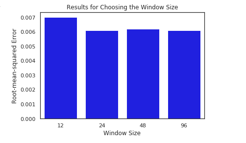

[](http://quantlet.de/)

```yaml
Name of QuantLet: Window_Size

Published in: 'DEDA Class'

Description: 'Select the optimal window-size for the training of the LSTM'

Keywords: window_size, optimal, LSTM

Author: Georg Velev, Iliyana Pekova

Submitted: Thu, August 01 2019 by Georg Velev, Iliyana Pekova

Output: 'Barplot_Window_Size in .PNG format'
```




### Python Code
```python
import numpy as np

# Pass an numpy array and generate the subsets:
def generate_Xtrain_yTrain_Xtest_Ytest(data,train_size_percentage,timesteps_in,timesteps_out):
    train_size=int(len(data)*train_size_percentage)
    train_data, test_data = data[:train_size], data[train_size:]
    X_train_data, y_train_data=split_sequence(train_data,timesteps_in,timesteps_out)
    X_test_data, y_test_data=split_sequence(test_data,timesteps_in,timesteps_out)
    return X_train_data, y_train_data,X_test_data, y_test_data

ETH=ethereum["Hourly_returns"].sort_index(ascending=True).values.astype('float32')

# We don't want to set the window size too big as this would increase the computational cost enormously
# However the window size should not be set too small as the LSTM may then never reach the global minimumof the error function
# test the LSTM with these four values:
timesteps=[12,24,48,96]
rmse_ar=[]
for time in timesteps:
  X_train, y_train, X_test, y_test=generate_Xtrain_yTrain_Xtest_Ytest(ETH,0.8,time,24)
  model=multi_step_LSTM(n_steps_in=time)
  model.fit(X_train, y_train,verbose=0)
  rmse=round(model.evaluate(X_test,y_test,verbose=0),4)
  rmse_ar.append(rmse)
  

sns.set(style="white")
ax =sns.barplot(timesteps,rmse_ar,color="blue")
ax.set(xlabel='Window Size', ylabel='Root-mean-squared Error', title="Results for Choosing the Window Size")
plt.show()
```
