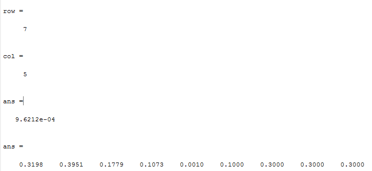

[](http://quantlet.de/)

```yaml
Name of QuantLet: optimal_weights_CVaR

Published in: 'DEDA Class'

Description: 'Determining which the optimal portfolio weights are and what CVaR they result into'

Keywords: optimal weights, minimal CVaR

Author: Georg Velev, Iliyana Pekova

Submitted: Thu, August 01 2019 by Georg Velev, Iliyana Pekova

Output: 'optimal_weights_CVaR in .PNG format'
```




### MATLAB code
```matlab
%print the minimal CVaR and the corresponding optimal portfolio weights
[row,col] = find(mat==min(mat(:,5)))
mat(row,col)
mat(row,:)
```


